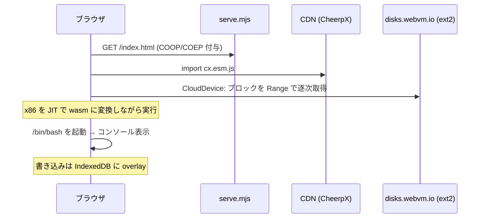
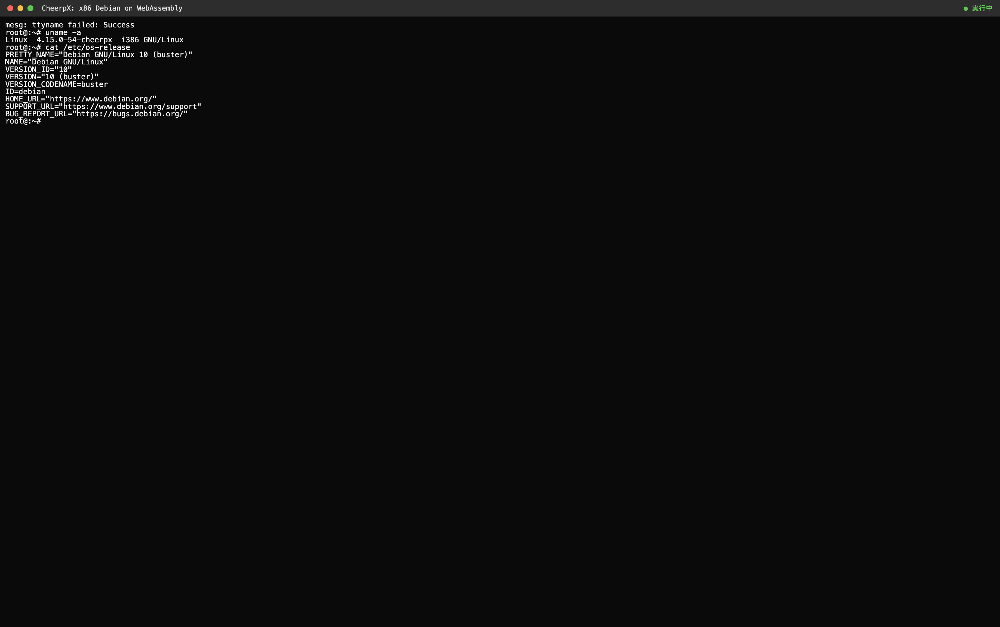
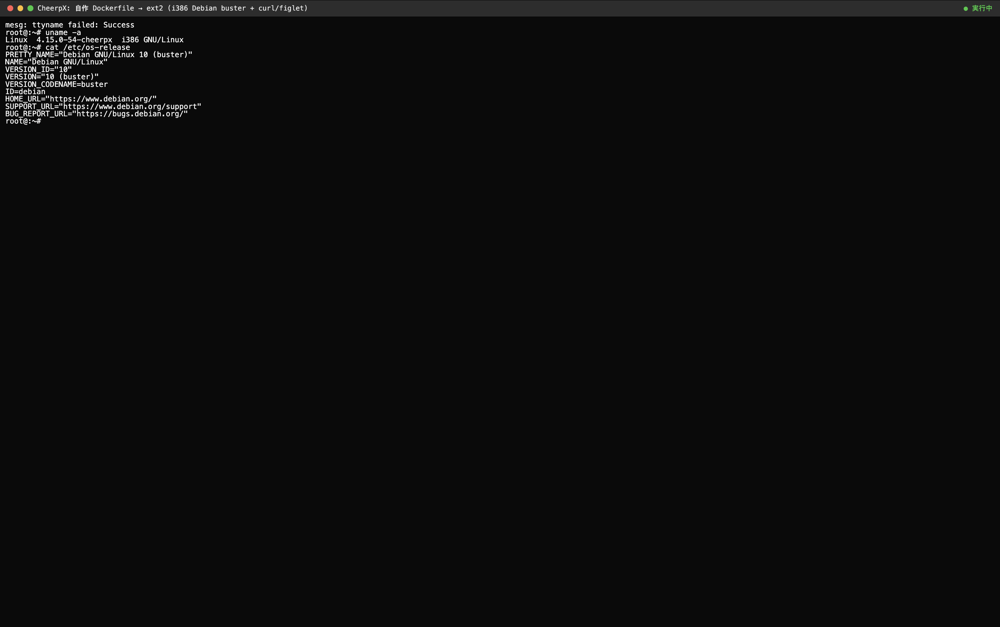
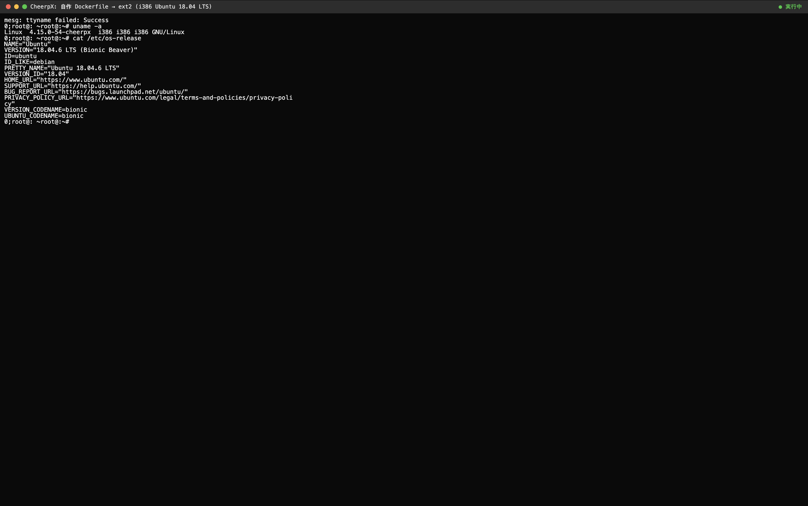

## はじめに

以前、container2wasm でブラウザの中に Linux(Alpine + RISC-V)を起動して、`c2w-net`
経由で外部ネットへ通信する PoC を作りました。そうなると当然「**別アプローチでもブラウザ
の中で Linux を動かせるのでは？**」と気になります。

そこで [CheerpX](https://cheerpx.io/)(Leaning Technologies 製の x86→WebAssembly JIT
エンジン)を試しました。結論から書くと、こうなりました。

- ✅ サーバや Docker、ネイティブアプリ無しで **ブラウザの中だけで x86 Debian が起動**
- ✅ **自分で書いた Dockerfile → ext2 ディスクイメージ → ブラウザ起動** が一通り通った
- ✅ Debian buster / Ubuntu 18.04(どちらも i386)で起動を確認

リポジトリはこちらです。

https://github.com/NOGUD626/cheerpx-base-demo

:::message
ビルドした ext2 を **Docker/OCI イメージへ逆変換**する話(「rootfs は共通通貨」)は、
別記事に切り出しました → [ext2 も Docker イメージも中身は同じ rootfs](./rootfs-tar-interconversion.md)(別記事)
:::

## CheerpX とは(container2wasm との違い)

どちらも「ブラウザで Linux」ですが、アプローチが対照的です。

| | container2wasm (c2w) | **CheerpX(本記事)** |
|---|---|---|
| 方式 | RISC-V を TinyEMU で**エミュレーション** | x86 を **JIT で wasm に変換** |
| カーネル | 本物の Linux カーネル | Linux **syscall 互換レイヤー** |
| 中身 | OCI イメージ → wasm に同梱 | **ext2 ディスクイメージ**を HTTP でストリーム |
| 速度 | 遅い(逐次模倣) | 速い(JIT) |
| 入力単位 | Docker/OCI イメージ | ディスクイメージ(VM 寄り) |

ざっくり言うと、c2w は「律儀に 1 命令ずつ再現するエミュレータ」、CheerpX は「よく使う
x86 命令を wasm に翻訳キャッシュして高速化する翻訳エンジン」です。

## 環境

| 項目 | バージョン / 内容 |
|---|---|
| CheerpX | `https://cxrtnc.leaningtech.com/1.2.8/cx.esm.js`(CDN・固定) |
| ベースイメージ(配信用) | `wss://disks.webvm.io/debian_large_20230522_5044875331.ext2`(WebVM 公式) |
| 静的配信 | Node.js v23(自前 `serve.mjs`、依存パッケージ無し) |
| ブラウザ | Chrome(`SharedArrayBuffer` 対応) |
| ホスト | Apple Silicon Mac でも可(後述) |

> CheerpX は WebAssembly なので **ホストの CPU(Intel / Apple Silicon)は問いません**。
> x86 はあくまでゲスト(中身)の話で、ホスト側は wasm 経由なので ARM Mac でも動きます。

## できること / できないこと

| やりたいこと | 可否 | 補足 |
|---|---|---|
| ブラウザで x86 Debian を起動 | ⭕ | `apt` / `dpkg` / `python3` など普通に動く |
| 自作 Dockerfile から好きな中身で起動 | ⭕ | i386(32bit)で作る必要あり |
| Ubuntu を動かす | △ | i386 は **18.04 が上限**(後述) |
| ネット(`apt` 等)を使う | △ | Tailscale 連携が必要(本記事では既定オフ) |
| Raspbian など **ARM 系**を動かす | ❌ | CheerpX は x86 専用。別アーキは不可 |

## 全体構成

CheerpX は `SharedArrayBuffer` を使うため、配信側に **Cross-Origin Isolation(COOP/COEP)**
が必須です。ディスクは丸ごとダウンロードせず、HTTP の Range リクエストで**必要なブロック
だけ遅延ロード**します。

```
[ブラウザ http://localhost:8080]
  ├ index.html        ← serve.mjs が COOP/COEP 付きで配信
  ├ CheerpX (cx.esm.js)   ← CDN から読み込む x86→wasm JIT エンジン
  │
  ├ ディスクデバイス
  │   ├ CloudDevice / HttpBytesDevice : ext2 を Range でストリーム(全DLしない)
  │   ├ IDBDevice     : ブラウザ内 (IndexedDB) の書き込み層
  │   └ OverlayDevice : 上2つを重ねて読み書き可能に
  │
  └ /bin/bash (x86) を JIT 実行 → <pre> をコンソールとして表示
```

## 実装

最小構成は 2 ファイルだけです。

```
cheerpx-base-demo/
├ index.html   ← CheerpX を読み込み Debian を起動
├ serve.mjs    ← COOP/COEP + Range + Last-Modified/ETag 対応の静的サーバ
├ custom.html  ← 自作 ext2 を起動する例(後半で使用)
└ Dockerfile   ← 自作イメージのビルド定義
```

### 1. COOP/COEP 付きの静的サーバ(serve.mjs)

`SharedArrayBuffer` 有効化のため、全レスポンスに分離ヘッダを付けます。さらに後半の
自作 ext2 を読むため、**Range(206)** と **`Last-Modified` / `ETag`** にも対応させます
(`HttpBytesDevice` がこれらを要求するため。ハマりどころで後述)。

```js
// serve.mjs(抜粋)
const ISOLATION_HEADERS = {
  "Cross-Origin-Opener-Policy": "same-origin",
  "Cross-Origin-Embedder-Policy": "require-corp",
  "Cross-Origin-Resource-Policy": "same-origin",
};

const baseHeaders = {
  "Content-Type": type,
  "Accept-Ranges": "bytes",                 // 部分読みを許可
  "Last-Modified": st.mtime.toUTCString(),  // HttpBytesDevice が要求
  "ETag": `"${st.size}-${Math.floor(st.mtimeMs)}"`,
  ...ISOLATION_HEADERS,
};
// Range: bytes=start-end が来たら 206 + Content-Range で部分応答
```

### 2. CheerpX で Debian を起動(index.html)

リモートの Debian ext2 を `CloudDevice` でストリーム取得し、IndexedDB の書き込み層を
`OverlayDevice` で重ねて読み書き可能にします。あとは `/bin/bash` を実行するだけです。

```js
// index.html(抜粋)
import * as CheerpX from "https://cxrtnc.leaningtech.com/1.2.8/cx.esm.js";

// ① Debian イメージを wss でストリーム(全DLせず遅延ロード)
const cloud = await CheerpX.CloudDevice.create(
  "wss://disks.webvm.io/debian_large_20230522_5044875331.ext2"
);
// ② ブラウザ内の書き込み層を重ねる
const overlay = await CheerpX.OverlayDevice.create(
  cloud, await CheerpX.IDBDevice.create("cheerpx-lab-block")
);

// ③ Linux インスタンス生成 → コンソール接続 → シェル実行
const cx = await CheerpX.Linux.create({
  mounts: [
    { type: "ext2", path: "/", dev: overlay },
    { type: "devs", path: "/dev" },
  ],
});
cx.setConsole(document.getElementById("console"));
await cx.run("/bin/bash", ["--login"], { cwd: "/root", uid: 0, gid: 0, env: [/* … */] });
```

`node serve.mjs` で起動して `http://localhost:8080` を開くと、数十秒で Debian の
プロンプトが出ます。

## 動作シーケンス

ブートまでの流れを整理すると、こうなります。



## 動作確認(Debian)

起動後、コンソールで叩いてみます。

```sh
$ uname -a
Linux 4.15.0-54-cheerpx i386 GNU/Linux        # ← ブラウザの中の x86 Debian
$ cat /etc/os-release
PRETTY_NAME="Debian GNU/Linux 10 (buster)"
$ dpkg --version                              # apt/dpkg 系 = Debian
```

<!-- スクショ①: index.html を開いて Debian buster が起動し uname -a が i386 cheerpx を表示している画面 -->

*↑ ブラウザのタブの中で x86 Debian が起動している様子*

`i386` と出ているのがポイントです。ARM Mac 上のブラウザでも、wasm が間に入るので
**ホストの CPU を問わず** x86 ゲストが動きます。

## 自作 Dockerfile からイメージを作って起動する

ここからが本題です。CheerpX は OCI イメージを直接は食べませんが、**Dockerfile から
ext2 ディスクイメージに変換**すれば、自分の好きな中身で起動できます。

```
[Dockerfile (i386 必須)]
   ↓ buildah build --platform linux/i386
[コンテナイメージ]
   ↓ buildah mount + mkfs.ext2 -d (ディレクトリごと ext2 化)
[custom.ext2]
   ↓ 同一オリジンに置く (serve.mjs は Range/Last-Modified 対応済み)
[CheerpX.HttpBytesDevice.create("/custom.ext2")]
```

### ビルド手順(Linux + buildah 環境)

```sh
# 1) Dockerfile(★ ベースは 32bit x86 = i386 必須)
cat > Dockerfile <<'EOF'
FROM --platform=linux/i386 docker.io/i386/debian:buster
ARG DEBIAN_FRONTEND=noninteractive
RUN echo "deb [trusted=yes] http://archive.debian.org/debian buster main" > /etc/apt/sources.list
RUN apt-get update && apt-get -y install curl figlet
RUN echo "Built via Dockerfile on $(date -u)" > /etc/cheerpx-custom-marker.txt
EOF

# 2) ビルド(x86_64 ホストでも i386 はネイティブ実行できる)
buildah build -f Dockerfile --dns=none --platform linux/i386 -t cheerpximage

# 3) ext2 化(e2fsprogs 1.43+ の mkfs.ext2 -d が必要)
buildah unshare bash -c '
  buildah from --name c cheerpximage
  mnt=$(buildah mount c)
  mkfs.ext2 -b 4096 -d "$mnt" custom.ext2 600M
  buildah umount c && buildah rm c'

# 4) 中身検証(マウントせず確認)
debugfs -R "cat /etc/cheerpx-custom-marker.txt" custom.ext2
```

### ブラウザ側(custom.html)

プレーンな ext2 をローカルから読むときは `CloudDevice` ではなく **`HttpBytesDevice`**
を使います(Range を自動で処理してくれます)。

```js
// custom.html(抜粋)
const block = await CheerpX.HttpBytesDevice.create("/custom.ext2");
const overlay = await CheerpX.OverlayDevice.create(
  block, await CheerpX.IDBDevice.create("cheerpx-custom-debian")
);
const cx = await CheerpX.Linux.create({
  mounts: [{ type: "ext2", path: "/", dev: overlay }, { type: "devs", path: "/dev" }],
});
```

`custom.ext2` をリポジトリ直下に置いて `custom.html` を開くと、Dockerfile で仕込んだ
マーカーや `figlet` がそのまま動きます。

```sh
$ cat /etc/cheerpx-custom-marker.txt
Built via Dockerfile on ...
$ figlet hello       # Dockerfile で apt install したものが動く
```

<!-- スクショ②: custom.html で自作 Debian ext2 が起動し、marker と figlet が出ている画面 -->

*↑ Dockerfile で仕込んだマーカーと figlet が、ブラウザの中でそのまま動く*

### Ubuntu 18.04 でも

ベースを `i386/ubuntu:bionic` にすれば Ubuntu も起動します。

```sh
$ cat /etc/os-release
NAME="Ubuntu"
VERSION="18.04.6 LTS (Bionic Beaver)"
```

<!-- スクショ③: custom.html で Ubuntu 18.04 が起動し os-release が表示されている画面 -->

*↑ 同じ仕組みで Ubuntu 18.04(i386)もブラウザの中で起動*

### 検証結果

Debian と Ubuntu の両方で、自作 ext2 のブラウザ起動を確認しました。

| ベース | 結果 | 備考 |
|---|---|---|
| `i386/debian:buster` | ⭕ 起動 + `apt` で追加パッケージも成功 | apt は `archive.debian.org` で素直に通る |
| `i386/ubuntu:bionic`(18.04) | ⭕ 起動(ベース userland のみ) | i386 は **18.04 が上限**。bionic は EOL で apt が一手間 |

## ビルド済みイメージの保全

ここで一つ注意点。**ベースイメージ(Docker Hub の `i386/debian` 等)や apt アーカイブ
は将来 pull 不能になりうる**ので、そうなると Dockerfile からの再ビルドができなくなります。

そこで **ビルド済みの ext2 を gzip 圧縮して GitHub Releases に保全**しておきました。
ext2 は中身がスカスカなので、よく縮みます。

| アセット | 元 | 圧縮後 |
|---|---|---|
| Debian buster i386 | 600M | **69M** |
| Ubuntu 18.04 i386 | 600M | **26M** |

これは完成品なので、**ベースイメージが消えても「動かす」のは無傷**(再ビルド不要)です。

## ハマりどころ

### HttpBytesDevice が `Last-Modified` / `ETag` を要求する

自作 ext2 を読むと、こんなエラーが出ました。

```
Initialization failed for 'HttpBytesDevice': Server didn't include header
`Last-Modified` nor header `Etag`
```

イメージの一貫性確認のため、これらのヘッダが必須です。`serve.mjs` 側で `Last-Modified`
と `ETag` を返すようにしたら通りました。直したのにエラーが消えないときは、ブラウザの
**ハードリロード(キャッシュ無視)** を忘れずに。

### i386(32bit)の壁

CheerpX は **32bit x86 専用**です。ここから 2 つ制約が出ます。

- **Ubuntu は i386 が 18.04 が上限**(20.04 以降は i386 廃止)。ブラウザで動かせる Ubuntu
  は実質 18.04 まで。Debian は buster 以降も i386 があるので、パッケージを足して遊ぶなら
  Debian の方が扱いやすいです。
- **ARM 系(Raspbian など)は不可**。動かしたいなら CheerpX ではなく、QEMU を wasm 化した
  フルエミュレータ(c2w 寄りの遅い方式)が必要です。

### EOL ディストリの apt

Ubuntu 18.04(bionic)は EOL でアーカイブ構成が崩れており、`old-releases` の i386 パスが
404 になって `apt update` が通りませんでした。今回はパッケージ追加を諦め、ベースの
userland だけで起動確認しています。

## まとめ

- **CheerpX を使うと、サーバや Docker 無しでブラウザの中だけで x86 Debian/Ubuntu が動く**
- **自作 Dockerfile → ext2 → ブラウザ起動** が一通り通った(Debian / Ubuntu 18.04 とも確認)
- CheerpX は **32bit x86 専用**。Ubuntu は 18.04 が上限、ARM 系は不可
- ビルド済み ext2 は **gzip して GitHub Releases に保全**すれば、ベースイメージ消滅にも耐える

なお、ここで作った ext2 は **Docker/OCI イメージへ逆変換**することもできます。その話は
別記事「ext2 も Docker イメージも中身は同じ rootfs」にまとめました。

## 参考

- CheerpX ドキュメント: https://cheerpx.io/docs/getting-started
- Custom disk images(CheerpX Docs): https://cheerpx.io/docs/guides/custom-images
- WebVM(CheerpX のフル実装例): https://github.com/leaningtech/webvm
- 本記事のリポジトリ: https://github.com/NOGUD626/cheerpx-base-demo
