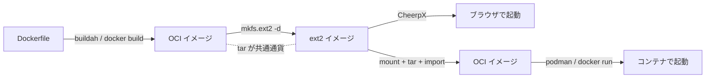

## はじめに

CheerpX でブラウザの中に x86 Linux を動かす実験をしていて、Dockerfile から ext2 ディスク
イメージを作りました(→ 別記事「[CheerpX でブラウザの中だけで x86 Debian/Ubuntu を動かす](./cheerpx-browser-x86-linux.md)」)。

そのとき「**この ext2、逆に Docker イメージとして使い直せるのでは？**」と思って試したら、
結論から書くと、できました。しかも理屈はシンプルで、

- **Docker イメージ / ext2 / Firecracker の rootfs / container2wasm の同梱 rootfs は、
  どれも「rootfs を別の入れ物に詰めただけ」**
- だから **`tar` を共通通貨にして相互変換できる**
- 実際に `ext2 → OCI イメージ → コンテナ起動` を `podman` で確認した

という話です。

## rootfs は共通通貨

「rootfs(root filesystem)」は、Linux が起動したときに `/`(ルート)として見える
ファイル一式のことです。`/bin`・`/etc`・`/usr`・`/lib` … あの中身まるごと。

コンテナ系・VM 系のいろいろなフォーマットは、結局この rootfs を**別の容器に入れている
だけ**です。

```
            ┌──────────── rootfs (/ 以下のファイル一式) ────────────┐
Docker イメージ   ext2 ディスク   Firecracker rootfs   c2w の同梱 rootfs
   (OCI/tar)       (FS イメージ)      (ext4)             (wasm 内)
```

| フォーマット | 容器 | 主な用途 |
|---|---|---|
| Docker / OCI イメージ | レイヤー化された tar + メタ情報 | コンテナ実行 |
| ext2 / ext4 イメージ | ファイルシステムイメージ | VM・CheerpX・Firecracker |
| Firecracker rootfs | ext4 ブロックデバイス | microVM |
| container2wasm | wasm に同梱した rootfs | ブラウザ内 Linux |

容器が違うだけで中身(rootfs)は同じなので、**`tar` で取り出して詰め替えれば相互に
変換できます**。



## ext2 → Docker イメージへ逆変換する

やることは「ext2 をマウント → 中身を tar → `docker import`(または `podman import`)」
だけです。

```sh
# ext2 をループマウント
sudo mount -o loop custom.ext2 /mnt

# 中身を tar にしてイメージへ取り込む
sudo tar -C /mnt -c . | docker import - mycustom:latest

# 起動コマンド等のメタ情報も付けたい場合
sudo tar -C /mnt -c . | docker import -c 'CMD ["/bin/bash"]' - mycustom:latest

sudo umount /mnt
```

## 実機で一周させてみる

ここでは Docker daemon の代わりに `podman`(Docker 互換の OCI ランタイム。
`podman run` ≒ `docker run`)で確認しました。x86_64 ホストなら i386 ユーザーランドも
ネイティブに動きます。

ext2 の中には、元の Dockerfile でこんなマーカーを仕込んでありました。

```dockerfile
RUN echo "Built via Dockerfile on $(date -u)" > /etc/cheerpx-custom-marker.txt
RUN apt-get -y install curl figlet
```

逆変換して起動します。

```sh
# ext2 → OCI イメージ
sudo mount -o loop custom.ext2 /mnt
sudo tar -C /mnt -c . | podman import -c 'CMD ["/bin/bash"]' - mycustom:from-ext2
sudo umount /mnt

# 起動して中身を確認
$ podman run --rm mycustom:from-ext2 cat /etc/cheerpx-custom-marker.txt
Built via Dockerfile on ...
$ podman run --rm mycustom:from-ext2 sh -c 'curl --version | head -1; uname -m'
curl 7.64.0 (i686-pc-linux-gnu) ...        # ← i686 = i386 バイナリ
x86_64                                       # ← 64bit カーネル上で i386 をネイティブ実行
```

Dockerfile で書いた一文がそのまま出ました。**Dockerfile → ext2 →(ブラウザ起動)→
OCI イメージ → コンテナ起動** と一周しても中身が保たれている、という確認です。

## 逆変換で失われるもの

rootfs(ファイルシステム)には「OS の中身」しか入っていないので、Docker イメージ特有の
メタ情報は失われます。

| 失われるもの | 補い方 |
|---|---|
| `CMD` / `ENTRYPOINT` / `ENV` / `WORKDIR` / `EXPOSE` | `docker import -c '...'` で付与、または `FROM mycustom` の Dockerfile で再指定 |
| レイヤー履歴 | 失われる(1 枚に潰れた single-layer になる) |
| アーキ | **元のまま**(i386 の ext2 なら i386 イメージ) |

つまり「**動く中身**」は完全に往復しますが、「**Docker らしい付帯情報**」は付け直す、という
感じです。

## ハマりどころ・注意

- **マウントは root 権限が必要**。`mount -o loop` できない環境(macOS など ext2 ドライバ
  が無い)では、Linux コンテナや VM を一枚かませて取り出すと楽。
- **アーキは ext2 の中身で決まる**。i386 の ext2 から作ったイメージは i386 なので、ARM
  ホストでは別途エミュレーションが要る。
- `tar` で取るとき、`/proc` `/sys` `/dev` のような擬似ファイルシステムは空でよい(中身は
  実行時にカーネルがマウントする)。

## まとめ

- **Docker イメージ / ext2 / Firecracker rootfs / c2w の rootfs は、すべて rootfs の詰め替え**
- だから **`tar` を共通通貨に相互変換できる**(`docker import` / `mkfs.ext2 -d` 等)
- 実際に **ext2 → OCI イメージ → 起動** を一周して、中身が保たれることを確認した
- 失われるのは `CMD`/`ENV` などのメタ情報とレイヤー履歴だけ。アーキは中身のまま

「コンテナか VM か」という見た目の違いに惑わされず、**中身は全部 rootfs**と捉えると、
フォーマット間の移動が一気に見通しよくなります。

## 参考

- `docker import` ドキュメント: https://docs.docker.com/reference/cli/docker/image/import/
- 関連記事: CheerpX でブラウザの中だけで x86 Debian/Ubuntu を動かす(別記事)
